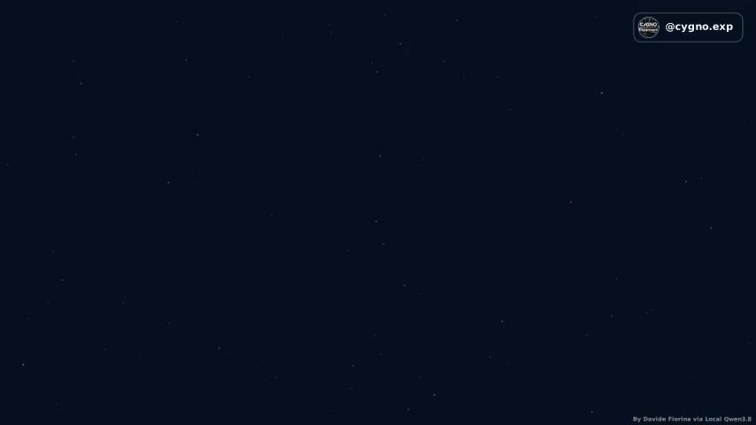
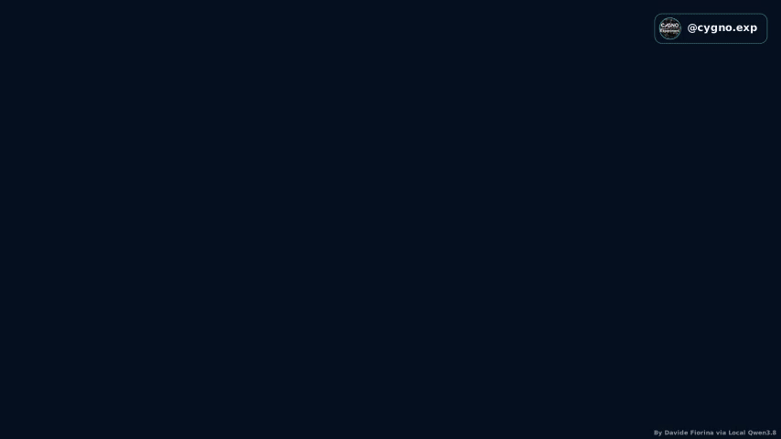

# CYGNO · Directional dark matter in motion

**From the Galactic halo to a reconstructed recoil track.**

A collection of Manim animations exploring how dark-matter motion, nuclear
recoils and optical gas-detector readout fit together in the CYGNO experiment.
Follow the story from the sky to the detector, then underground to Gran Sasso.

Created by **[Davide Fiorina](https://fiorotto8.github.io/)** ·
[ORCID 0000-0002-7104-257X](https://orcid.org/0000-0002-7104-257X)

[Watch the animations](#gallery) · [Portraits & Stories](#portraits--stories) ·
[Render locally](#render-locally) · [Scientific review](ANIMATION_REVIEW.md) ·
[CYGNO website](https://web.infn.it/cygnus/)

## Gallery

| A wind from the Galaxy | One recoil, from gas to readout |
|:---:|:---:|
| [](media/videos/01_galactic_wind/480p30/GalacticWind.mp4) | [](media/videos/04_cygno04_full_track/480p30/CYGNO04FullTrack.mp4) |
| The halo, the Solar System and the incoming dark-matter wind. | Ionization, amplification, light collection and offline analysis. |

**Click a preview to open its MP4.** All linked media are the low-resolution
copies included in this repository; viewing them requires no Python setup.

| Scene | What it shows | Landscape MP4 | GIF |
|---|---|:---:|:---:|
| **01 · Galactic wind** | Dark-matter halo, Solar motion and the sightline toward Cygnus. | [Watch](media/videos/01_galactic_wind/480p30/GalacticWind.mp4) | [Preview](media/videos/01_galactic_wind/480p30/GalacticWind.gif) |
| **02 · WIMP recoil** | Elastic scattering, gas ionization and statistical head–tail recognition. | [Watch](media/videos/02_wimp_recoil/480p30/WIMPRecoil.mp4) | [Preview](media/videos/02_wimp_recoil/480p30/WIMPRecoil.gif) |
| **03 · TPC readout** | A reference presentation of the time projection chamber and its sensors. | [Watch](media/videos/03_tpc_readout/480p30/TPCReadout.mp4) | [Preview](media/videos/03_tpc_readout/480p30/TPCReadout.gif) |
| **04 · Full track sequence** | Recoil → drift → GEM amplification → camera/PMT signals → acquisition → offline analysis. | [Watch](media/videos/04_cygno04_full_track/480p30/CYGNO04FullTrack.mp4) | [Preview](media/videos/04_cygno04_full_track/480p30/CYGNO04FullTrack.gif) |
| **05 · Inside Gran Sasso** | An illustrative route to Hall F and the detector shielding assembly. | [Watch](media/videos/05_lngs_positioning/480p30/LNGSPositioning.mp4) | [Preview](media/videos/05_lngs_positioning/480p30/LNGSPositioning.gif) |

**Review status.** Scenes 01, 02 and 04 have revised media available for review.
Scene 04 is the preferred detector sequence for new edits; Scene 03 remains
scientifically valid and renderable, but is deprecated as a presentation.
**Scene 05 is pending collaboration validation.** Technical verification does
not establish collaboration approval. See [the animation review](ANIMATION_REVIEW.md).

## Portraits & Stories

Four complete portrait animations and fourteen independent Stories adapt the
same scientific narrative to a vertical canvas. Stories run **15–21 seconds**
and establish their own visual context. The videos are silent, with English
diagram labels and space for later narration; titles and narration captions
are omitted. Scene 03 has no portrait version.

| Full portrait animation | Standalone Stories, in narrative order |
|---|---|
| [**01 · Galactic wind**](media/vertical/01_galactic_wind/360x640p30/VerticalGalacticWind.mp4) | [Halo](media/stories/01_galactic_wind/01_halo/360x640p30/01_halo.mp4) · [Cygnus wind](media/stories/01_galactic_wind/01_cygnus_wind/360x640p30/01_cygnus_wind.mp4) |
| [**02 · WIMP recoil**](media/vertical/02_wimp_recoil/360x640p30/VerticalWIMPRecoil.mp4) | [Recoil](media/stories/02_wimp_recoil/02_recoil/360x640p30/02_recoil.mp4) · [Ionization](media/stories/02_wimp_recoil/02_ionization/360x640p30/02_ionization.mp4) · [Head–tail sense](media/stories/02_wimp_recoil/02_sense/360x640p30/02_sense.mp4) |
| [**04 · Full track sequence**](media/vertical/04_cygno04_full_track/360x640p30/VerticalFullTrack.mp4) | [Recoil](media/stories/04_cygno04_full_track/04_recoil/360x640p30/04_recoil.mp4) · [Drift](media/stories/04_cygno04_full_track/04_drift/360x640p30/04_drift.mp4) · [GEM](media/stories/04_cygno04_full_track/04_gem/360x640p30/04_gem.mp4) · [Readout](media/stories/04_cygno04_full_track/04_readout/360x640p30/04_readout.mp4) · [DAQ & cloud](media/stories/04_cygno04_full_track/04_daq_cloud/360x640p30/04_daq_cloud.mp4) · [Offline analysis](media/stories/04_cygno04_full_track/04_offline/360x640p30/04_offline.mp4) |
| [**05 · Inside Gran Sasso**](media/vertical/05_lngs_positioning/360x640p30/VerticalLNGS.mp4) | [Gran Sasso](media/stories/05_lngs_positioning/05_gran_sasso/360x640p30/05_gran_sasso.mp4) · [Hall F](media/stories/05_lngs_positioning/05_hall_f/360x640p30/05_hall_f.mp4) · [Assembly](media/stories/05_lngs_positioning/05_assembly/360x640p30/05_assembly.mp4) |

### Available formats

| Format | Included in Git | Generated locally |
|---|---|---|
| Landscape · five scenes | **854×480**, 30 fps MP4 + looping GIF | **1920×1080**, 60 fps master |
| Portrait · four full videos | **360×640**, 30 fps MP4 | **1080×1920**, 30 fps posting file |
| Stories · fourteen clips | **360×640**, 30 fps MP4 | **1080×1920**, 30 fps posting file |

The repository contains **23 MP4s and 5 GIFs**. Only low-resolution media are
tracked. High-resolution masters and posting files, render caches, manifests
and local review material stay ignored. Portraits and Stories have no GIFs.

## What the animations represent

The scenes explain the steps of directional detection using deterministic,
illustrative events. Particle counts, amplification, light intensity and
pulse noise are qualitative; camera pixels come from a diffusion model.
They do not represent measured detector events or reconstruction performance.

- **Sky and incoming motion:** the Cygnus sightline points opposite to the
  incoming WIMP velocity in the configured Solar-frame picture.
- **Collision and recoil:** momentum transfer is `q = p_chi_in − p_chi_out`;
  for a stationary target, `p_recoil = q`.
- **Direction and sense:** a reconstructed track axis and a head–tail estimate
  are distinct observables. Sense recognition is statistical.
- **Readout and analysis:** camera images and PMT timing feed acquisition and
  storage, followed by offline analysis. The displayed 3D track has qualitative
  assigned depth, rather than a fit to the shown signals.
- **Underground layout:** the Hall F route follows image coordinates. It is
  illustrative, with no claim of surveyed navigation geometry.

Conventions and declared placeholders live in [config/science.yaml](config/science.yaml).
The [animation review](ANIMATION_REVIEW.md) records model limits, visual choices
and verification details for both landscape and portrait scenes.

## Render locally

Use **Linux or WSL, Python 3.12**, FFmpeg/ffprobe with libx264, Cairo/Pango,
DejaVu Sans and LaTeX/dvisvgm. From the repository root:

```bash
python3 -m venv --system-site-packages .venv
source .venv/bin/activate
python -m pip install -r requirements.txt
```

### Supply the authorized inputs

Rendering requires the original branding assets, which are supplied separately:

```text
assets/logo/cygno-logo.jpg
assets/logo/QR_website.png
assets/logo/cygno.exp_Instagram-qr.png
```

Scene 05 also requires the original underground image at
`assets/LNGS/View_exp_underground_2.png` and the complete authorized overlay at
`config/local.yaml`. This also applies to any `all` command that renders Scene 05.
To use an overlay stored elsewhere:

```bash
export CYGNO_LOCAL_CONFIG=/absolute/path/to/local.yaml
```

Obtain the cleared inputs from the maintainers; public placeholders must not be
filled with invented values. Keep source assets and private configuration out
of Git. Existing previews can be viewed without these inputs.

### Render a scene or a Story

```bash
# Landscape: one scene, or all five scenes
python scripts/render.py scene 04_cygno04_full_track
python scripts/render.py all

# Portrait: one full animation, a scene's Stories, or one Story
python scripts/render.py vertical scene 02_wimp_recoil
python scripts/render.py vertical stories 02_wimp_recoil
python scripts/render.py vertical story 04_readout

# All four portrait animations and all fourteen Stories
python scripts/render.py vertical all
```

Scene IDs are defined in [config/scenes.yaml](config/scenes.yaml).
Story IDs, section order and pacing are defined in
[config/vertical.yaml](config/vertical.yaml); each Story filename in the table
above, without `.mp4`, is its selectable ID.

### Verify the local delivery

```bash
python scripts/render.py verify --target all
```

Use `--target horizontal`, `vertical` or `stories` to check one family.
Plain `verify` checks the landscape family. Verification expects the complete
local output set for that family, including high-resolution files; run it after
rendering, with the required inputs available.

Checks cover output inventory, dimensions, codecs, frame rates, full decoding,
timing and source freshness. Portrait verification also checks the absence of
audio, closing artwork and website QR decoding in posting files. Instagram
artwork matching confirms preservation of the supplied image; app scanning
remains untested. Content fingerprints are stored under `media/manifests/`.

<details>
<summary><strong>Prepare a landscape publication package</strong></summary>

After branding, technical-data and Scene 05 approvals are recorded in the
private overlay:

```bash
python scripts/render.py package --tag release-2026-01
```

The command verifies the landscape outputs and writes five preview MP4s,
five GIFs and `SHA256SUMS` to `dist/<tag>/`. Packaging is local and does not
upload files. Portraits and Stories remain in their own output folders.

</details>

## Repository map

```text
config/               scene catalogs, scientific conventions and branding settings
cygno_anim/           shared physics, detector geometry, events and visual components
scenes/               five landscape scenes
scenes/vertical/      portrait sections and standalone Story entry states
scripts/              rendering, verification, provenance and packaging
media/videos/         landscape previews and GIFs tracked in Git
media/vertical/       full portrait previews tracked in Git
media/stories/        standalone Story previews tracked in Git
ANIMATION_REVIEW.md   scientific scope, presentation status and verification notes
```

## Credit and reuse

Created by **[Davide Fiorina](https://fiorotto8.github.io/)** for CYGNO scientific
communication. The animations carry the author credit, CYGNO branding and the
supplied closing QR artwork.

Source code and configuration are **BSD-3-Clause**; original documentation and
released animation media are **CC BY 4.0**. CYGNO and Instagram marks, QR artwork
and third-party assets are excluded from those grants. See [LICENSE](LICENSE),
[TRADEMARKS.md](TRADEMARKS.md) and [third-party notices](THIRD_PARTY_NOTICES.md)
for the exact scope. Citation metadata is available in [CITATION.cff](CITATION.cff).
